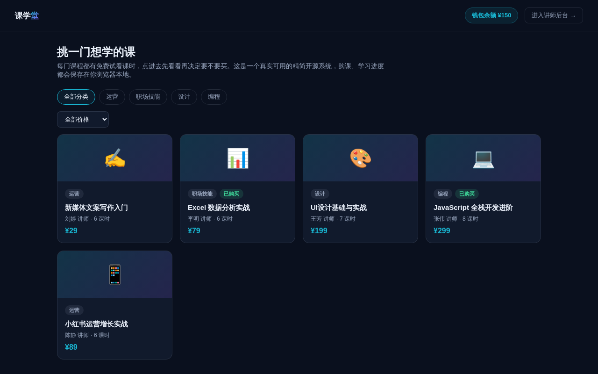

# 知识付费课程平台（精简开源版）· Course Lite

**[在线体验（前台）→](https://anna123123123-creator.github.io/course-lite/)** · **[讲师后台 →](https://anna123123123-creator.github.io/course-lite/admin.html)**

免费开源的知识付费课程平台精简版。这不是截图或原型图，是一个**真实可用**的前后台系统：课程浏览与筛选、免费试看、真实的钱包余额扣费购课、课时解锁与学习进度打卡，后台课程与课时增删改查、真实的收入与完成率统计——都是真功能，纯前端 + `localStorage` 实现，不需要服务器、不需要数据库，克隆下来打开就能用，也适合作为学习或二次开发的起点。



## 功能

**前台（学员视角）**
- 课程列表浏览，按分类、价格区间筛选
- 点开课程查看简介和课时列表，免费试看课时无需购买即可学习
- 未购买的课程，非试看课时显示锁定状态，无法查看内容
- "购买课程"：余额充足则真实扣款并解锁全部课时；余额不足会拒绝购买，并显示还差多少钱
- 已购课程可逐课时"标记完成"，实时展示 已完成/总课时 的学习进度条
- 钱包余额随时可见

**后台（讲师/运营视角）**
- 仪表盘：课程总数、总购课数、总收入、本月收入（按购买时间所在自然月实时计算）、平均完成率（所有已购课程的 已完成课时/总分配课时，真实除法）
- 课程管理：新增、编辑、删除课程（删除会一并清理该课程下的课时）
- 课时管理：按课程查看课时列表，新增、编辑、删除课时（标题、时长、是否试看、内容简介）

## 试用方法

克隆下来，直接用浏览器打开 `index.html`，或用静态文件服务器跑起来：

```bash
python3 -m http.server 8000
```

前台在 `index.html`，后台在 `admin.html`。所有数据存在浏览器的 `localStorage` 里（`course_lite_data_v1` 这个 key），后台侧边栏有"重置示例数据"按钮可以随时清空重来。

## 技术说明

没有用任何框架或构建工具，纯原生 HTML/CSS/JavaScript，一共 5 个文件：`data.js`（数据层，负责 localStorage 读写和种子数据）、`index.html` + `script.js`（前台）、`admin.html` + `admin.js`（后台）。因为是纯前端 Demo，数据只存在当前浏览器里，不同设备/浏览器之间不会同步，也没有真实的多用户账号体系——整个系统里只有"你"这一个本地学员，没有登录注册。真实生产系统需要一个后端 API、数据库和真实支付网关来替换 `data.js` 里的存储层与钱包扣款逻辑，其余的界面和交互逻辑基本可以直接复用。

## 协议

MIT，随便怎么用都行。

## 相关项目

这是完整版**知识付费课程平台**的精简开源示例——完整版支持多用户账号体系与真实支付结算、讲师分成与提现、直播课与录播课混合、学习证书与打卡社群，源码在这：[全能源码 · 知识付费源码](https://inzyxuashop.com/zhishi-fufei-yuanma.html)。
